# Tugas Lab4web
## Profil

| #               | Biodata             |
| --------------- | ------------------- |
| **Nama**        | Rangga Saputra |
| **NIM**         | 312010266           |
| **Kelas**       | TI.20.A.2           |
| **Mata Kuliah** | Pemrograman Web     |

## Langkah 1

### Membuat dokumen HTML dengan nama file `lab4_box.html` Setelah itu buat struktur dasar HTML
``` html
<!DOCTYPE html>
<html lang="en">
<head>
  <meta charset="UTF-8">
  <meta name="viewport" content="width=device-width, initial-scale=1.0">
  <title>Box Element</title>
</head>
<body>
  <header>
    <h1>Box Element</h1>
  </header>
</body>
</html>
```

* Maka hasilnya seperti ini
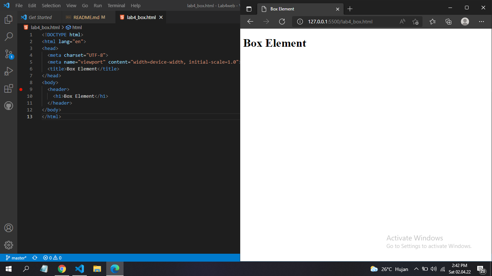

## Langkah 2 
### Membuat box element dengan tag div
```html 
<section>
  <div class="div1">Div 1</div>
  <div class="div2">Div 2</div>
  <div class="div3">Div 3</div>
</section>
```
* Maka Hasilnya seperti ini
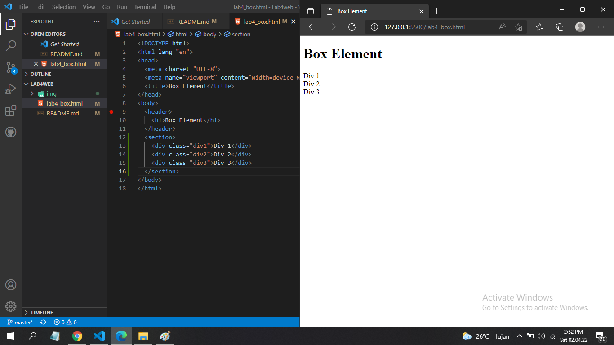

## Langkah 3 
### Tambahkan deklarasi CSS pada head untuk membuat float element
``` html
<style>
        div {
            float:left;
            padding: 10px;
        }
        .div1 {
            background: red;
        }
        .div2 {
            background: yellow;
        }
        .div3 {
            background: green;
        }
</style>
```
* Maka hasilnya akan seperti ini
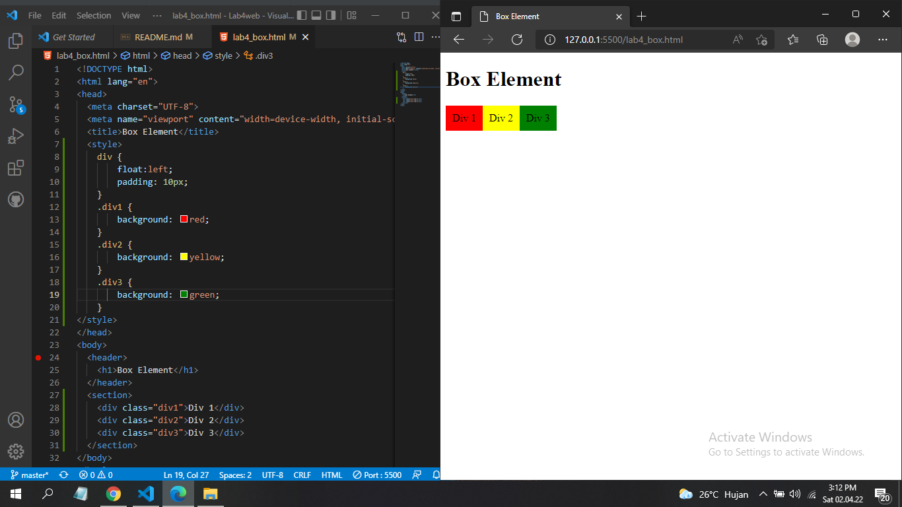

## Langkah 4
### Mengatur Clearfix Element. Clearfix digunakan untuk mengatur element setelah float element
1. Tambahkan element div lainnya seteleah div3
``` html 
<section>
  <div class="div1">Div 1</div>
  <div class="div2">Div 2</div>
  <div class="div3">Div 3</div>
  <div class="div4">Div 4</div>
</section>
```
2. Kemudian atur property clear pada CSS
```html
<style>.div4 {
  background-color: blue;
  clear: left;
  float: none;
}
```
* Maka hasilnya akan seperti ini
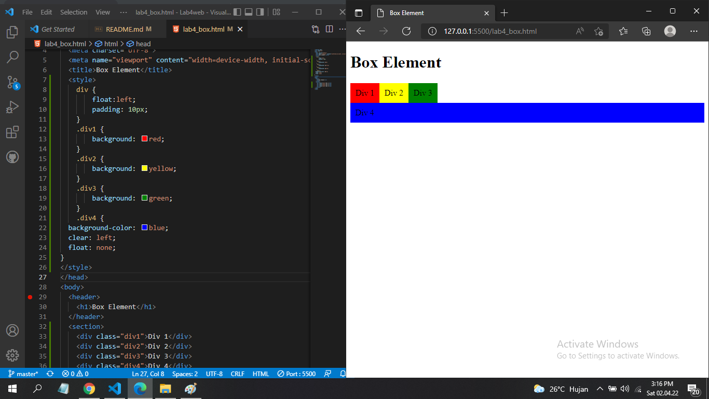

## Membuat layout sederhana
### Langkah 1
1. Buat folder baru dengan nama `lab4_layout`, kemudian buatlah file baru didalamnya dengan nama `home.html` dan file css dengan nama `style css`
* contohnya seperti ini

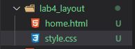

2. Kemudian coding `home.html`
``` html
<!DOCTYPE html>
<html lang="en">
<head>
    <meta charset="UTF-8">
    <meta name="viewport" content="width=device-width, initial-scale=1.0">
    <title>Layout Sederhana</title>
    <link rel="stylesheet" href="style.css">
</head>
<body>
    <div id="container">
        <header>
            <h1>Layout Sederhana</h1>
        </header>
        <nav>
            <a href="home.html" class="active">Home</a>
            <a href="artikel.html">Artikel</a>
            <a href="about.html">About</a>
            <a href="kontak.html">Kontak</a>
        </nav>
        <section id="hero"></section>
        <section id="wrapper">
            <section id="main"></section>
            <aside id="sidebar"></aside>
        </section>
        <footer>
            <p>&copy; 2021 - Universitas Pelita Bangsa</p>
        </footer>
    </div>
</body>
</html>
```
* Maka hasilnya akan seperti ini
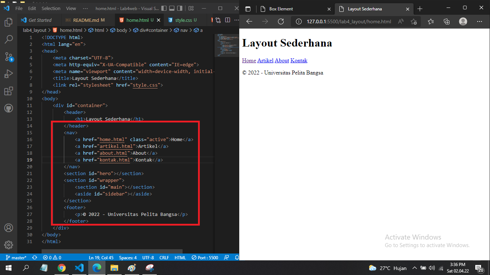

2. dan coding pada file `css`
```css
/* import google font */
@import
url('https://fonts.googleapis.com/css2?family=Open+Sans:ital,wght@0,300;0,400;0,600;0,700;0,800;1,300;1,400;1,600;1,700;1,800&display=swap');
@import
url('https://fonts.googleapis.com/css2?family=Open+Sans+Condensed:ital,wght@0,300;0,700;1,300&display=swap');

/* Reset CSS */
* {
    margin: 0;
    padding: 0;
}
body {
    line-height:1;
    font-size:100%;
    font-family:'Open Sans', sans-serif;
    color:#5a5a5a;
}
#container {
    width: 980px;
    margin: 0 auto;
    box-shadow: 0 0 1em #cccccc;
}

/* header */
header {
    padding: 20px;
}
header h1 {
    margin: 20px 10px;
    color: #b5b5b5;
}
```
* hasilnya akan seperti ini
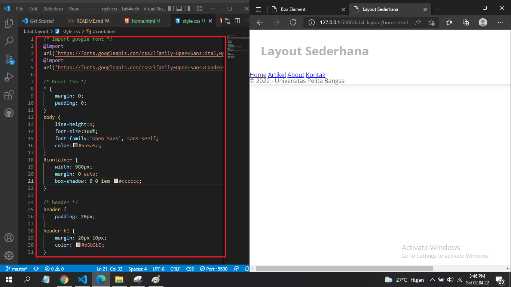

## Langkah 2
### Mengatur Navigasi pada CSS
``` css
/* navigasi */
nav {
    display: block;
    background-color: #1f5faa;
}
nav a {
    padding: 15px 30px;
    display: inline-block;
    color: #ffffff;
    font-size: 14px;
    text-decoration: none;
    font-weight: bold;
}
nav a.active,
nav a:hover {
    background-color: #2b83ea;
}
```
* Maka Hasilnya akan seperti ini
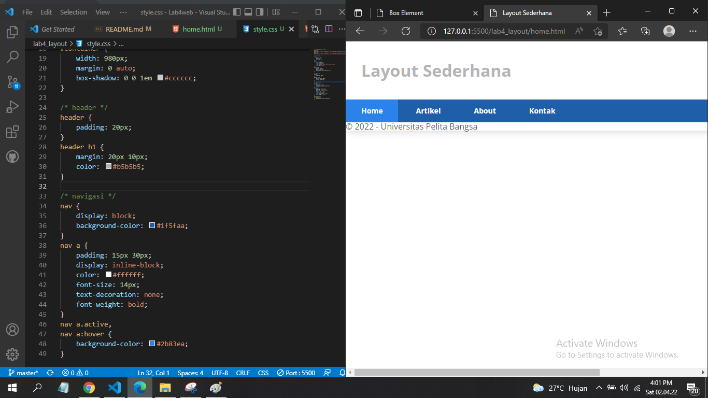

## Langkah 3
### Membuat Hero Panel
1. Tambahkan coding pada `home.html`
``` html
<section id="hero">
    <h1>Hello World!</h1>
    <p>Lorem ipsum dolor sit amet, consectetur adipiscing elit. Vestibulum lorem
elit, iaculis innisl volutpat, malesuada tincidunt arcu. Proin in leo fringilla,
vestibulum mi porta, faucibus felis. Integer pharetra est nunc, nec pretium nunc
pretium ac.</p>
    <a href="home.html" class="btn btn-large">Learn more &raquo;</a>
</section>
```
2. Tambahkan coding pada `style.css`
```css
/* Hero Panel */
#hero {
    background-color: #e4e4e5;
    padding: 50px 20px;
    margin-bottom: 20px;
}
#hero h1 {
    margin-bottom: 20px;
    font-size: 35px;
}
#hero p {
    margin-bottom: 20px;
    font-size: 18px;
    line-height: 25px;
}
```
* Maka hasilnya akan seperti ini
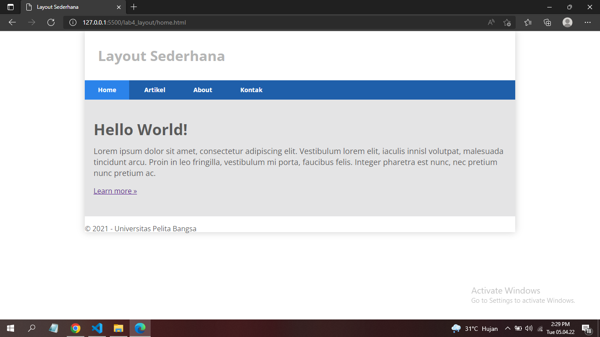

## Langkah 4 `Mengatur Layout Main dan Sidebar`
1. Tambahkan coding pada `style.css`
```css
/* main content */
#wrapper {
    margin: 0;
}
#main {
    float: left;
    width: 640px;
    padding: 20px;
}

/* sidebar area */
#sidebar {
    float: left;
    width: 260px;
    padding: 20px;
}
```
* Maka hasilnya akan seperti ini
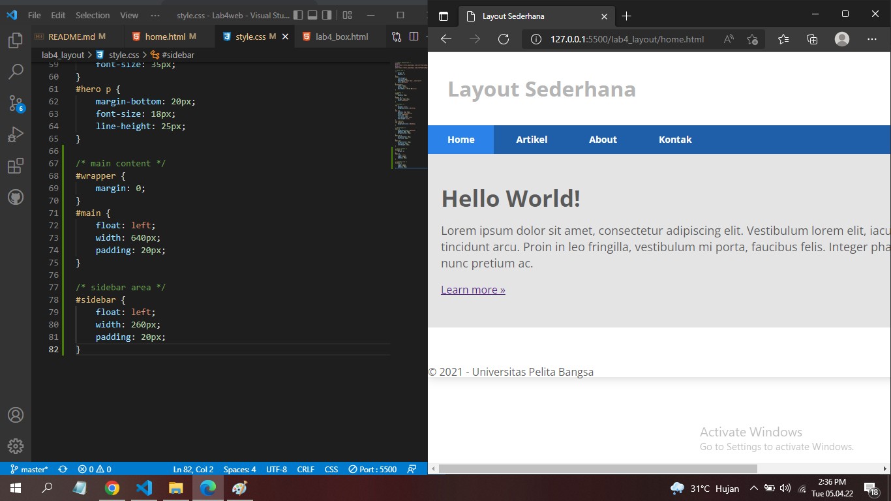

## Langkah 5 `Membuat Sidebar Widget`
1. Tambahkan element berikut didalam id `sidebar.`
```html
<aside id="sidebar">
    <div class="widget-box">
        <h3 class="title">Widget Header</h3>
        <ul>
            <li><a href="#">Widget Link</a></li>
            <li><a href="#">Widget Link</a></li>
            <li><a href="#">Widget Link</a></li>
            <li><a href="#">Widget Link</a></li>
            <li><a href="#">Widget Link</a></li>
        </ul>
    </div>
    <div class="widget-box">
        <h3 class="title">Widget Text</h3>
        <p>Vestibulum lorem elit, iaculis in nisl volutpat, malesuada tincidunt
            arcu. Proin in leo fringilla, vestibulum mi porta, faucibus felis. Integer
            pharetra est nunc, nec pretium nunc pretium ac.</p>
    </div>
</aside>
```
2. Tambahkan coding pada `style.css`
```css
* widget */
.widget-box {
    border:1px solid #eee;
    margin-bottom:20px;
}
.widget-box .title {
    padding:10px 16px;
    background-color:#428bca;
    color:#fff;
}
.widget-box ul {
    list-style-type:none;
}
.widget-box li {
    border-bottom:1px solid #eee;
}
.widget-box li a {
    padding:10px 16px;
    color:#333;
    display:block;
    text-decoration:none;
}
.widget-box li:hover a {
    background-color:#eee;
}
.widget-box p {
    padding:15px;
    line-height:25px;
}
```
* codinganya seperti ini
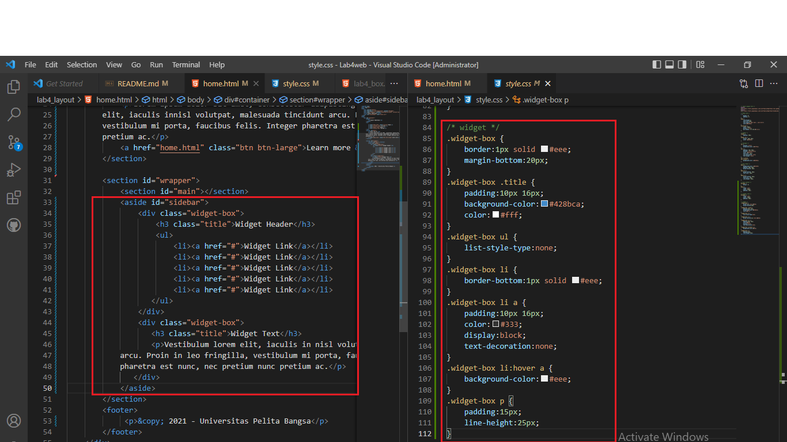

* Maka hasilnya akan seperti ini
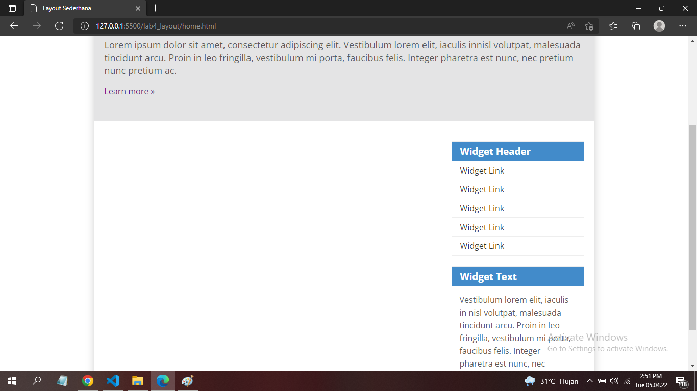

## Langkah 6 `Mengatur fotter`
1. Tambahkan css berikut.
```css
/* footer */
footer {
    clear:both;
    background-color:#1d1d1d;
    padding:20px;
    color:#eee;
}
```
* Maka hasilnya akan seperti ini
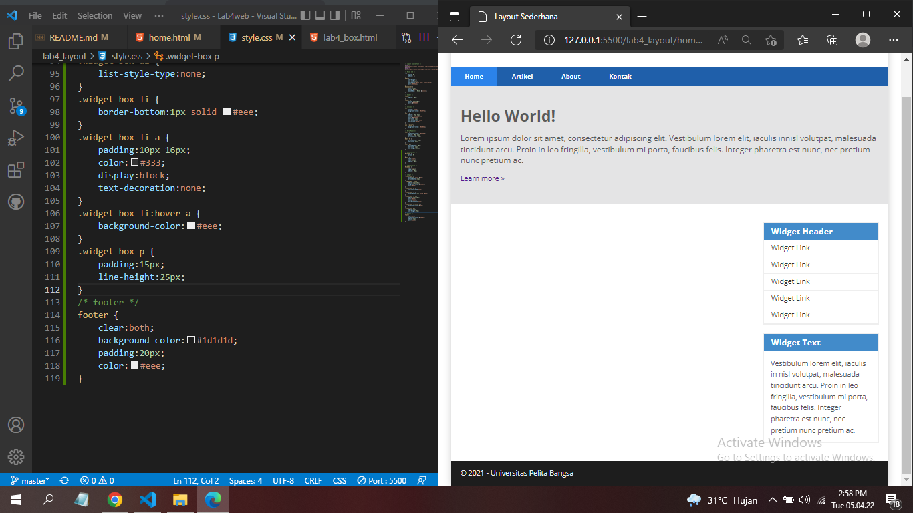

## Langkah 7 `Menambahkan Element lainnya pada Main Content`
1. Tambahkan Coding pada `home.html`.
```html 
<section id="main">
    <div class="row">
        <div class="box">
            
            <h3>Heading</h3>
            <p>Donec sed odio dui. Etiam porta sem malesuada magna mollis
euismod.</p>
            <a href="#" class="btn btn-default">View detail</a>
        </div>
        <div class="box">
            
            <h3>Heading</h3>
            <p>Donec sed odio dui. Etiam porta sem malesuada magna mollis
euismod.</p>
            <a href="#" class="btn btn-default">View detail</a>
        </div>
        <div class="box">
            
            <h3>Heading</h3>
            <p>Donec sed odio dui. Etiam porta sem malesuada magna mollis
euismod.</p>
            <a href="#" class="btn btn-default">View detail</a>
        </div>
    </div>
</section>
```
2. Tambahkan Coding pada `style.css`
```css
/* box */
.box {
    display:block;
    float:left;
    width:33.333333%;
    box-sizing:border-box;
    -moz-box-sizing:border-box;
    -webkit-box-sizing:border-box;
    padding:0 10px;
    text-align:center;
}
.box h3 {
    margin: 15px 0;
}
.box p {
    line-height: 20px;
    font-size: 14px;
    margin-bottom: 15px;
}
box img {
    border: 0;
    vertical-align: middle;
}
.image-circle {
    border-radius: 50%;
}
.row {
    margin: 0 -10px;
    box-sizing: border-box;
    -moz-box-sizing: border-box;
    -webkit-box-sizing: border-box;
}
.row:after, .row:before,
.entry:after, .entry:before {
    content:'';
    display:table;
}
.row:after,
.entry:after {
    clear:both;
}
```
* codinganya seperti ini
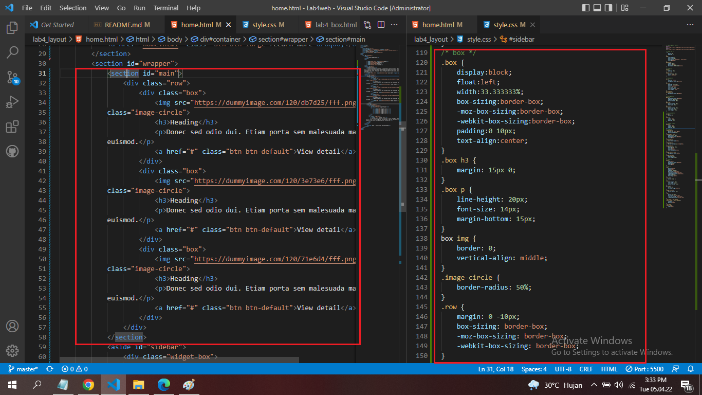

* Maka hasilnya akan seperti ini
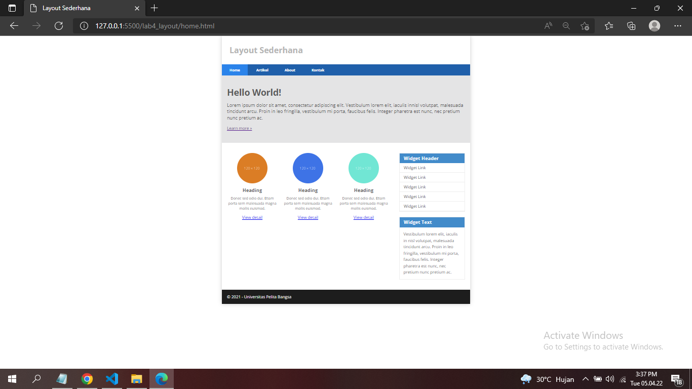

## Langkah 8 `Menambahkan Content Artikel`
1. Tambahkan Coding pada `home.html`
```html
<hr class="divider" />
<article class="entry">
    <h2>First featurette heading.</h2>
    
    <p>Lorem ipsum dolor sit amet, consectetur adipiscing elit. Vestibulum lorem
elit, iaculis in nisl volutpat, malesuada tincidunt arcu. Proin in leo fringilla,
vestibulum mi porta, faucibus felis. Integer pharetra est nunc, nec pretium nunc
pretium ac.</p>
</article>
<hr class="divider" />
<article class="entry">
    <h2>First featurette heading.</h2>
    
    <p>Lorem ipsum dolor sit amet, consectetur adipiscing elit. Vestibulum lorem
elit, iaculis in nisl volutpat, malesuada tincidunt arcu. Proin in leo fringilla,
vestibulum mi porta, faucibus felis. Integer pharetra est nunc, nec pretium nunc
pretium ac.</p>
</article>
```
2. Tambahkan Coding pada `style.css`
```css
.divider {
    border:0;
    border-top:1px solid #eeeeee;
    margin:40px 0;
}
/* entry */
   .entry {
    margin: 15px 0;
}
   .entry h2 {
    margin-bottom: 20px;
}
.entry p {
    line-height: 25px;
}
.entry img {
    float: left;
    border-radius: 5px;
    margin-right: 15px;
}
.entry .right-img {
    float: right;
}
```
* Maka hasilnya akan seperti ini
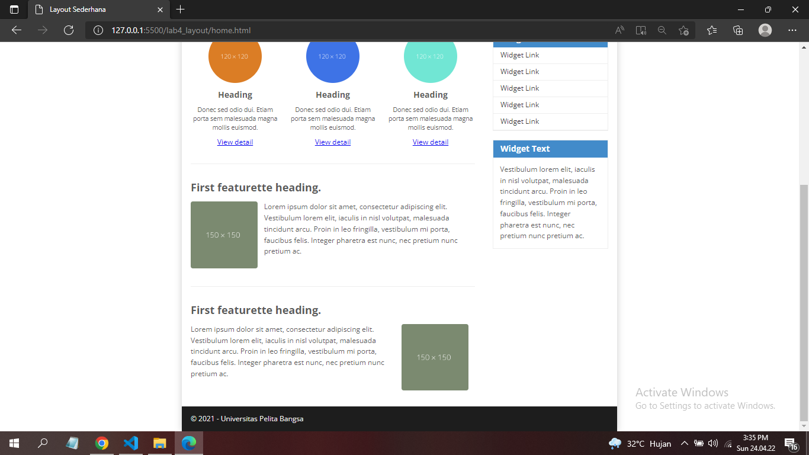

# Pertanyaan dan Tugas

## 1. Tambahkan Layout untuk menu About
> buat single layout yang berisi deskripsi, portfolio, dll
## 2. Tambahkan layout untuk menu Contact
> yang berisi form isian: nama, email, message, dll
# Jawab

## 1. Menambahkan Menu About.

**HTML**

```html
<!DOCTYPE html>
<html lang="en">
<head>
    <meta charset="UTF-8">
    <meta http-equiv="X-UA-Compatible" content="IE=edge">
    <meta name="viewport" content="width=device-width, initial-scale=1.0">
    <title>About</title>
    <link rel="stylesheet" href="style.css">
</head>
<body>
    <div id="container">
        <header>
            <h1>About Me</h1>
        </header>
        <nav>
            <a href="home.html">Home</a>
            <a href="artikel.html">Artikel</a>
            <a href="about.html"  class="active">About</a>
            <a href="kontak.html">Kontak</a>
        </nav>
        <section id="about">
            <div class="bio">
                
                <h2>Rangga Saputra</h2>
                <p class="p-bio">Perkenalkan saya Rangga Saputra, saya sedang belajar memahami HTML dan CSS serta senang mengedit video</p>
            </div>
        </section>
        <footer>
            <p>&copy; 2022 - Universitas Pelita Bangsa</p>
        </footer>
    </div>
        </section>
        <footer>
            <p>&copy; 2022 - Universitas Pelita Bangsa</p>
        </footer>
    </div>
</body>
</html>
```

**CSS**

```css
/* about panel */
#about {
    padding: 15px;
}
.bio img {
    float: left;
    margin: 15px;
    border-radius: 50%;
    width: 160px;
    border: 2px solid black;
}
.bio h2 {
    position: relative;
    margin: 20px;
}
.bio p.p-bio {
    font-size: 15px;
    margin: 20px;
}
```

Hasilnya seperti berikut.
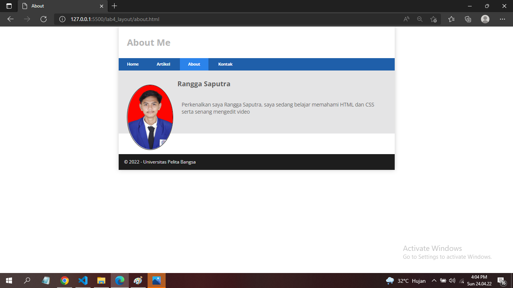

## 2. Membuat Menu Kontak.
### HTML
``` hTML
<!DOCTYPE html>
<html lang="en">
<head>
    <meta charset="UTF-8">
    <meta http-equiv="X-UA-Compatible" content="IE=edge">
    <meta name="viewport" content="width=device-width, initial-scale=1.0">
    <title>Kontak</title>
    <link rel="stylesheet" href="style.css">
</head>
<body>
    <div id="container">
        <header>
            <h1>Kontak</h1>
        </header>
        <nav>
            <a href="home.html">Home</a>
            <a href="artikel.html">Artikel</a>
            <a href="about.html">About</a>
            <a href="kontak.html" class="active">Kontak</a>
        </nav>
        <div id="c-kontak">
            <div id="h-kontak">
                <h2>Kontak saya</h2>
            </div>
            <section id="form-kontak">
                <form action="#">
                    <input type="text" id="form-isi" placeholder="Nama">
                    <input type="email" id="form-isi" placeholder="Email">
                    <textarea name="" id="form-isi" cols="30" rows="10" placeholder="Pesan"></textarea>
                    <button>Kirim</button>
                </form>
            </section>
        </div>
        <footer>
            <p>&copy; 2022 - Universitas Pelita Bangsa</p>
        </footer>
    </div>
</body>
</html>
```
## CSS
```css
/* kontak panel */

#form-kontak {
    padding: 20px;
    width: 95%;
}

#h-kontak {
    margin: 20px;
}

#form-isi {
    box-sizing: border-box;
    width: 100%;
    padding: 10px;
    margin-bottom: 10px;
    border: 1px solid  #1f5faa;
    border-radius: 2px;
    font-family: 'Franklin Gothic Medium', 'Arial Narrow', Arial, sans-serif;
}

button {
    float: right;
    background-color: #1f5faa;
    color: white;
    padding: 10px 20px;
    border: none;
    border-radius: 2px;
    margin-bottom: 20px;
}
```
Hasilnya akan seperti ini
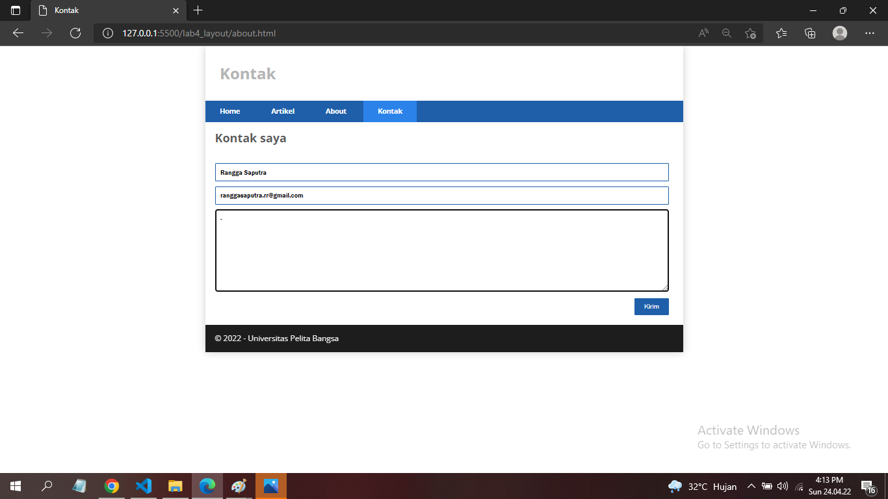


